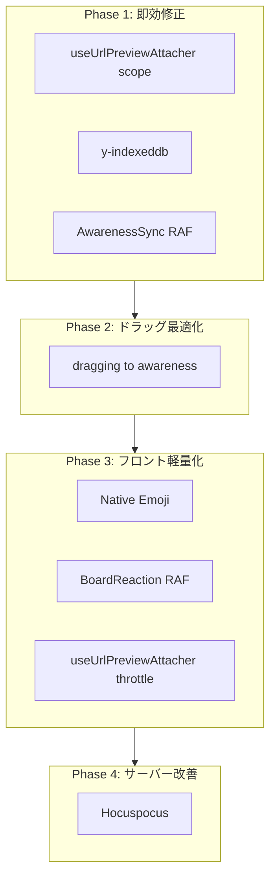

# 軽量化フェーズ計画

> **作成日**: 2026-03-07  
> **元資料**: [yjs-system-specification.md](../dev/yjs-system-specification.md)、[performance-optimization-plan.md](./performance-optimization-plan.md)、[yjs-improvement-selection.md](./yjs-improvement-selection.md)

---

## 前提

- 想定規模: 30人同時接続 / 1000シェイプ
- 目標: 1,800 updates/sec → 約30 updates/sec、リロード即時化、低スペPC対応

---

## フェーズ概要図

---

## Phase 1: 即効修正（工数: 極小〜小）

| 順 | 施策 | 工数 | 効果 | 対象ファイル |
|----|------|------|------|--------------|
| 1 | useUrlPreviewAttacher `source: "all"` → `"user"` | 1行 | 1,800回/秒 → 0（リモートカーソルで発火しない） | [useUrlPreviewAttacher.ts](../../nextjs-web/src/app/hooks/useUrlPreviewAttacher.ts) |
| 2 | y-indexeddb 導入 | 数行 | リロード即時復元、オフライン編集、Y.Doc 差分のみ同期（**導入済み**） | [useYjsStore.ts](../../nextjs-web/src/app/hooks/useYjsStore.ts) |
| 3 | AwarenessSync `syncRemoteToStore` に RAF スロットル | 小 | 1,800回/秒 → 60回/秒 | [AwarenessSync.tsx](../../nextjs-web/src/app/components/collaboration/AwarenessSync.tsx) |

**依存**: なし。並行実施可能。  
**検証**: 30人カーソル移動時に useUrlPreviewAttacher 発火がユーザー操作時のみに制限されること。

---

## Phase 2: ドラッグ最適化（工数: 中）

| 施策 | 内容 | 対象ファイル |
|------|------|--------------|
| dragging → awareness | ドラッグ中は `awareness.setLocalStateField("dragging", {...})` で座標送信。drop 時のみ Y.Doc に `store.put` | useYjsStore.ts、AwarenessSync.tsx、シェイプ描画レイヤー |

**効果**: Y.Update 60回/秒/人 → 0（ドラッグ中）。Y.Doc 肥大化防止。  
**依存**: Phase 1 の RAF スロットル（Awareness 処理が安定してから推奨）。  
**設計**: ドラッグ中シェイプを他クライアントで表示する際、Store の座標ではなく Awareness の `dragging` を参照する必要あり。compound/tldraw のドラッグフロー調査が前提。

---

## Phase 3: フロント軽量化（工数: 小〜中）

| 施策 | 効果 | 対象 |
|------|------|------|
| Twemoji → Native Emoji オプション | 数百リクエスト削減、描画負荷軽減 | ShapeReactionPanel、リアクション表示コンポーネント |
| BoardReactionProvider RAF + 差分検知 | `applyYUpdate` を 60回/秒に抑制、不要な setByShape 防止 | BoardReactionProvider |
| ポーリング間隔延長 | Yjs 接続時 2s → 15s、未接続 15s → 30s | リアクション・AssetLoader |
| OGP/embed 遅延読み込み | フォーカス or スクロールイン時のみ iframe 生成 | useUrlPreviewAttacher 周辺 |

**依存**: Phase 1 完了後。Phase 2 と並行可。  
**低スペPC**: 仕様書 §18 で挙げた Twemoji・iframe・波形200バーをここで軽減。

---

## Phase 4: サーバー改善（工数: 大）

| 施策 | 内容 | 条件 |
|------|------|------|
| Hocuspocus 導入 | y-websocket-server → Hocuspocus。SQLite/PostgreSQL/S3 永続化、Webhook、認証 | 30人超 or サーバー再起動リスク解消が必要なとき |
| Y-Sweet | 代替案。S3 直永続、Rust。Figma 的な構成 | Hocuspocus が合わない場合 |

**依存**: Phase 1–3 完了後。ローカルサーバー1台で十分な現状なら後回し可。  
**判断**: 仕様書 §8 に「30人超で Hocuspocus 検討」とあるため、現規模ではオプション。

---

## Phase 5: 長期・オプション

| 施策 | 条件 |
|------|------|
| Y-Octo (Rust CRDT) | web 専用なら yjs で十分。Electron/mobile 対応時 |
| YKeyValue (y-utility) | Phase 2 後も Y.Doc 肥大化が残る場合 |
| ffmpeg.wasm | サーバー2分タイムアウト・ジョブ化の代替。ブラウザ側変換 |
| シェイプ仮想化 | 画面外描画スキップ。1000シェイプで効果大 |
| JSON → binary encoding | per-record 形式の CPU/memory 軽減。大規模リファクタ |

---

## 推奨実装順序

1. **Phase 1 一括**: useUrlPreviewAttacher (1行) → y-indexeddb → AwarenessSync RAF
2. **Phase 2**: dragging → awareness（設計検討後に着手）
3. **Phase 3**: Native Emoji オプション、BoardReaction RAF、ポーリング延長
4. **Phase 4**: 必要に応じて Hocuspocus
5. **Phase 5**: スケール・要件変化時に検討

---

## 関連ドキュメント

- [yjs-system-specification.md](../dev/yjs-system-specification.md) - 仕様・技術一覧
- [performance-optimization-plan.md](./performance-optimization-plan.md) - 負荷対策の詳細
- [yjs-improvement-selection.md](./yjs-improvement-selection.md) - 改善ライブラリ・選定
