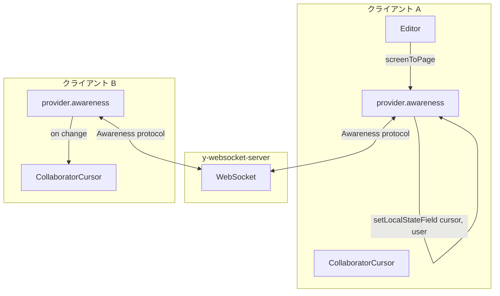

# マルチカーソル機能 実装手順書

> **実装状況**: 完了。AwarenessSync、CollaboratorCursor、UserSharePanel を実装済み。カーソルは RAF スロットルでスムーズに更新。

## 概要

Gachaboard は Yjs + WebsocketProvider でドキュメント同期を行い、Yjs Awareness CRDT を用いたマルチカーソルを実装済み。本ドキュメントは実装手順と参考情報をまとめる。

---

## 1. 技術選定の結論

### 採用方針: Yjs Awareness CRDT

- **現状**: useYjsStore は WebsocketProvider を使用しており、`y-websocket` は Awareness プロトコルを標準サポートしている
- **sync-server**: y-websocket-server は Awareness をそのまま中継するため、サーバー側の変更は不要
- **tldraw/compound との関係**: compound は `@tldraw/sync` を使わず独自の Yjs 同期を実装しているため、tldraw の TLInstancePresence ベースの presence とは別経路で、Yjs Awareness を直接使うのが自然

### 参考実装（GitHub / ドキュメント）

| ソース | 内容 |
|--------|------|
| [Yjs Awareness Docs](https://docs.yjs.dev/getting-started/adding-awareness) | Awareness CRDT の基本、`user` / `cursor` フィールド |
| [tldraw Cursors](https://tldraw.dev/sdk-features/cursors) | CollaboratorCursor のカスタマイズ、TLCursorProps |
| [tldraw Collaboration](https://tldraw.dev/sdk-features/collaboration) | Presence レコード構造、`scope: 'presence'` |
| [tldraw sync-custom-presence](https://tldraw.dev/examples/sync-custom-presence) | getUserPresence によるカスタム presence |
| [Excalidraw P2P Collaboration](https://plus.excalidraw.com/blog/building-excalidraw-p2p-collaboration-feature) | オフスクリーン時のカーソル表示（画面端インジケータ） |
| [y-websocket Awareness](https://docs.yjs.dev/ecosystem/connection-provider/y-websocket) | プロバイダー標準の Awareness サポート |

---

## 2. アーキテクチャ

- **Awareness は Y.Doc とは別**: 永続化されず、接続中のみ保持。30 秒更新無しでオフライン扱い
- **座標**: ページ座標（page space）で共有するのが一般的。tldraw では `editor.screenToPage({ x, y })` で変換

---

## 3. 実装手順

### Phase 1: useYjsStore で Awareness を露出

1. **provider の ref を返す**: `useYjsStore` の戻り値に `provider` または `awareness` を追加
2. **型**: `TLStoreWithStatus` を拡張するか、`{ ...yjsStore, provider }` の形で返す

### Phase 2: ローカル Awareness の更新

1. **user フィールド**: マウント時に `awareness.setLocalStateField('user', { name, color })` を設定
2. **cursor フィールド**: ポインター移動時に `editor.screenToPage()` で変換し、`awareness.setLocalStateField('cursor', { x, y, type })` を更新
3. **キャンバス外**: `pointerleave` 時は `cursor: null` を設定して非表示にする

### Phase 3: リモート Awareness の購読とレンダリング

1. **awareness.on('change')**: 他クライアントの追加・更新・削除を検知
2. **getStates()**: `Map<clientID, state>` で全状態を取得。自クライアントを除外して表示
3. **CollaboratorCursor コンポーネント**: 各リモートユーザー用にカーソルを描画

### Phase 4: CollaboratorCursor の実装

1. **Compound の components**: boardOverrides または Compound の `components` オーバーライドで `CollaboratorCursor` を渡す
2. **レンダリング**: `position: absolute` で `pageToScreen` した座標に配置。ユーザー名・色を表示
3. **オフスクリーン**: Excalidraw と同様、画面外の場合は画面端にインジケータを表示するオプション（任意）

### Phase 5: UserSharePanel（オプション）

- 接続中のユーザー一覧を表示。`awareness.getStates()` から取得してリスト表示

---

## 4. 主要ファイル変更一覧

| ファイル | 変更内容 |
|----------|----------|
| useYjsStore.ts | provider/awareness を返す、user の初期設定 |
| CompoundBoard.tsx | useYjsStore から provider 取得、awareness を Editor に渡す |
| CollaboratorCursor.tsx | awareness を購読してリモートカーソルを描画 |
| 新規: useAwarenessCursor.ts | ポインター移動 → awareness 更新のロジックを分離（任意） |

---

## 5. ユーザー色・名前の取得

- **userName**: CompoundBoard の props で既に `userName` を受け取っている
- **color**: USER_COLORS パレットからランダムまたは currentUserId のハッシュで決定。tldraw のパレットを参考に実装可能

---

## 6. 注意点・落とし穴

1. **Strict Mode**: 現在 `connect: false` で 50ms 遅延接続している。Awareness の初期化も同様にマウント後に実施
2. **座標系**: 必ず page 座標で共有。screen 座標はデバイス毎に異なるため不適
3. **更新頻度**: ポインター移動は RAF スロットルで 60fps 更新（実装済み）
4. **compound の CollaboratorCursor**: compound が tldraw 由来の CollaboratorCursor をサポートしている。LiveCollaborators が instance_presence を参照するため、Yjs Awareness → instance_presence へのブリッジが必要

---

## 8. 実装済み（2025年3月）

- **useYjsStore**: provider を返す、userId による user/color の Awareness 初期設定
- **AwarenessSync**: Yjs Awareness ↔ instance_presence ブリッジ、ローカル cursor の送信。RAF スロットルで 60fps 更新
- **CollaboratorCursor**: compound の LiveCollaborators が instance_presence を参照して描画
- **UserSharePanel**: 接続中ユーザー一覧（ヘッダーに表示）
- **同一ユーザー複数タブ**: userId でグループ化し 1 本のカーソルに統合
