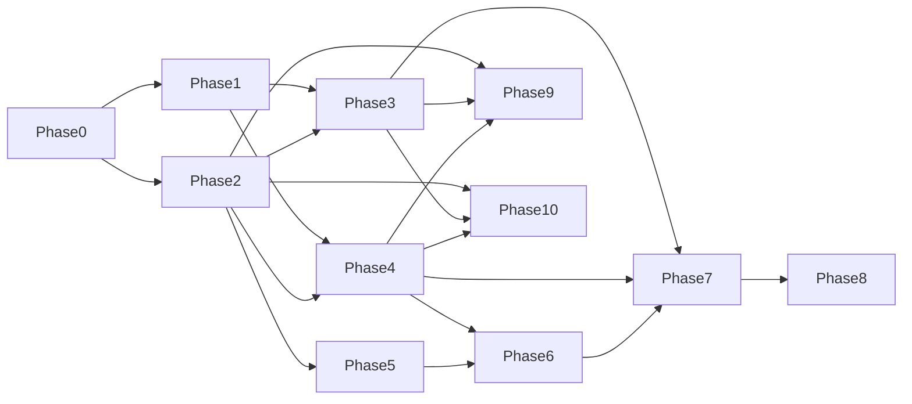

# マスタータスクボード（全残タスク確定版）

実装を容易にするため、全フェーズの残タスクを「着手単位」まで分解したボード。

## 実行ルール

- `Phase 0` を通過するまで実装開始しない。
- 各タスクは `done条件` を満たしたら完了にする。
- 認可（`guildId` 境界）は全フェーズ共通の必須条件。

## 依存関係（簡易）

## Phase 0: ギャップ調査（関門）

- [ ] P0-01 現行機能一覧を確定（同期/Presence/資産/OGP）
- [ ] P0-02 再実装機能一覧を確定（Auth/Guild分離/変換/コメント/リアクション/コネクタ）
- [ ] P0-03 上流参照リンクを固定（tldraw/draw.io/unfurl）
- [ ] P0-04 DB運用チェックリストを全項目確認
- [ ] P0-05 バックアップ/復元の実行手順をドキュメント化
- [ ] P0-06 認可境界検証シナリオを作成
- [ ] P0-07 Go/No-Go判定を記録
- done条件:
  - DB運用チェックが全て埋まっている
  - 認可/整合性/復元の検証計画が書面化されている

## Phase 1: Discord認証基盤

- [ ] P1-01 Auth.js を導入
- [ ] P1-02 Discord Provider を設定（`guilds` scope）
- [ ] P1-03 セッション型を拡張（`discordId/name/avatar`）
- [ ] P1-04 サインイン/サインアウトUIを配置
- [ ] P1-05 認証失敗時ハンドリング（再試行導線）
- [ ] P1-06 `.env.example` に認証変数を追加
- done条件:
  - ログイン後に `id/name/icon` が表示される

## Phase 2: DB/スキーマ基盤

- [ ] P2-01 Prisma 導入とDB接続
- [ ] P2-02 モデル作成（User/Guild/GuildMember/Project/Board/Asset）
- [ ] P2-03 追加モデル作成（MediaComment/ObjectReaction/Connector）
- [ ] P2-04 外部キー/複合ユニーク/索引の定義
- [ ] P2-05 初期マイグレーション作成
- [ ] P2-06 ローカルseed作成
- [ ] P2-07 境界制約テスト（guild跨ぎ不許可）
- done条件:
  - `guildId/projectId/boardId` 境界がDB制約で担保される

## Phase 3: App Router導線

- [ ] P3-01 `/projects` 一覧ページ
- [ ] P3-02 プロジェクト作成フロー（`guildId` 必須）
- [ ] P3-03 `/project/[projectId]` 詳細ページ
- [ ] P3-04 `/project/[projectId]/board/[boardId]` ページ
- [ ] P3-05 URLコピー導線
- [ ] P3-06 ローディング/エラー画面
- done条件:
  - Guild内のプロジェクト/ボードへ遷移できる

## Phase 4: Guild認可と保護

- [ ] P4-01 `middleware.ts` で未ログイン保護
- [ ] P4-02 Server Component側でguild境界チェック
- [ ] P4-03 API側でguild境界チェック
- [ ] P4-04 `403/404` 方針統一
- [ ] P4-05 認可拒否監査ログ
- [ ] P4-06 直URLアクセス試験ケース作成
- done条件:
  - 他GuildのProject/Board/Assetにアクセスできない

## Phase 5: ローカル運用と永続化

- [ ] P5-01 Postgres永続ボリューム固定
- [ ] P5-02 オブジェクト保存先をローカルディスク固定
- [ ] P5-03 Dドライブ前提の起動手順記載
- [ ] P5-04 バックアップ手順記載
- [ ] P5-05 リストア手順記載
- [ ] P5-06 容量監視項目を定義
- done条件:
  - 再起動後もデータ保持される

## Phase 6: 資産削除GUI

- [ ] P6-01 `/assets` 一覧画面
- [ ] P6-02 Guild境界付き一覧取得
- [ ] P6-03 削除API（DB + 実体）
- [ ] P6-04 削除確認ダイアログ
- [ ] P6-05 監査ログ保存
- [ ] P6-06 削除後の再取得不可テスト
- done条件:
  - GUI削除後、対象資産を取得できない

## Phase 7: メディア拡張

- [ ] P7-01 YouTube埋め込み（ドメイン検証）
- [ ] P7-02 OGP取得API（タイムアウト/失敗フォールバック）
- [ ] P7-03 OGPキャッシュ実装
- [ ] P7-04 動画簡易プレビュー（サムネイル中心）
- [ ] P7-05 wav->mp3 非同期変換ジョブ
- [ ] P7-06 変換状態表示（processing/ready/failed）
- [ ] P7-07 GIF貼り付け/アップロード対応
- [ ] P7-08 GIF容量制限と運用ルール
- done条件:
  - YouTube/OGP/動画プレビュー/wavプレビュー/GIF が成立

## Phase 8: タイムラインコメント

- [ ] P8-01 `MediaComment` API（作成/一覧/更新/削除）
- [ ] P8-02 再生ヘッド連動UI（音声/動画）
- [ ] P8-03 コメントクリックでシーク
- [ ] P8-04 同時刻コメント束ね表示
- [ ] P8-05 ページング/仮想化
- [ ] P8-06 監査ログ連携
- done条件:
  - 時刻コメントと再生位置ジャンプが双方向で機能する

## Phase 9: オブジェクトリアクション（Twemoji）

- [ ] P9-01 リアクションAPI（追加/解除/一覧）
- [ ] P9-02 同emojiトグル制御（同一ユーザ）
- [ ] P9-03 集計表示（emojiごとの件数）
- [ ] P9-04 リアクションピッカーUI
- [ ] P9-05 shape選択時の表示制御
- [ ] P9-06 Guild境界認可テスト
- done条件:
  - object単位でTwemojiリアクションを共有できる

## Phase 10: コネクタ体験（draw.io風）

- [ ] P10-01 固定アンカー実装
- [ ] P10-02 浮動アンカー実装
- [ ] P10-03 スナップ閾値と候補ハイライト
- [ ] P10-04 コネクタCRUD API
- [ ] P10-05 直線/直交ルーティング切替
- [ ] P10-06 障害物回避と再ルーティング
- [ ] P10-07 Waypoint手動編集
- [ ] P10-08 Auto-connect最小実装
- [ ] P10-09 テレメトリ計測（失敗率/再接続率）
- done条件:
  - 「吸い付く接続」体験を維持したまま共同編集で破綻しない

## 横断タスク（全フェーズ共通）

- [ ] X-01 エラーハンドリング規約を統一
- [ ] X-02 ログフォーマットを統一（監査/アプリ）
- [ ] X-03 Feature flag設計（重機能の段階公開）
- [ ] X-04 E2Eテストシナリオ整備
- [ ] X-05 リリース手順（ロールバック含む）を文書化

## 実装開始順（推奨）

1. `P0-*` 全完了
2. `P1-*` と `P2-*` を並行
3. `P3-*` と `P4-*` を並行
4. `P5-*` を早めに完了
5. `P6-*` -> `P7-*`
6. `P8-*` と `P9-*` を並行
7. `P10-*` を最後に集中的に実装
