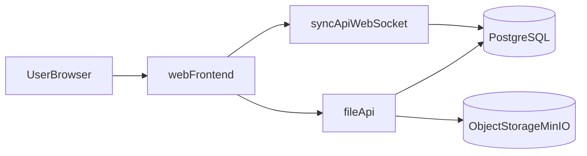

# tldrawプロジェクト統合計画（環境構築・コンセプト・実装）

## 1. ゴールと前提

### ゴール
- `whiteboard-multiplayer` をベースに、リアルタイム共同編集（カーソル同期含む）を維持したまま、将来的に大容量資産（最大50GB、zip中心）を安定運用できる構成へ発展させる。
- 開発・検証はローカルで回せるようにし、本番は Linux + Docker で再現可能な形にそろえる。

### 前提条件
- 共同編集のコア体験は維持（同時編集、Presence、ルーム共有）。
- zip 実体はキャンバスデータと分離して保管する。
- このリポジトリは `tldraw` のマルチプレイヤースターターを基盤にする。

## 2. 現状サマリ

### できていること
- `whiteboard-multiplayer` の生成済み。
- `npm install` 済み。
- `npm run dev` でフロント起動確認済み（Vite）。
- `client/pages/Room.tsx` で `useSync` を使った共同編集接続が動作する構成。

### 未完了
- Docker 未導入（`docker` コマンド未認識の状態だったため、Docker 検証は未実施）。
- Linux 本番向け `docker-compose` 構成は未作成。
- zip のメタデータ管理 API / DB は未実装。

### 既知制約
- Windows で `tldraw` 本体モノレポを直接扱う場合、ワークスペースリンクで詰まりやすい。
- 現在のスターターは Cloudflare 前提のサンプルであり、ローカル Linux 運用には構成の置き換えが必要。

## 3. tldrawで今回活かす機能

### リアルタイム共同編集
- `client/pages/Room.tsx` の `useSync` + `Tldraw` が共同編集の中心。
- ルームURL共有で同一ボードに参加し、カーソルや編集内容を同期可能。

### 資産アップロード導線
- `client/multiplayerAssetStore.tsx` で `TLAssetStore` を実装。
- アセットは `/api/uploads/:uploadId` へPOST、キャンバス側はURL/参照を保持。
- この設計を zip 対応向けに拡張しやすい。

### サーバルーティング
- `worker/worker.ts` で `/api/connect/:roomId`（同期）と `/api/uploads/:uploadId`（資産）を分離。
- 「同期チャネル」と「大容量ファイル転送」の役割分離方針に合致。

## 4. 目標アーキテクチャ（Linux + Docker）

### コンポーネント
- `webFrontend`: tldraw UI、ルーム遷移、アップロードUI。
- `syncApiWebSocket`: 共同編集イベント、presence、ルーム状態管理。
- `fileApi`: zip のアップロード/ダウンロード、認可、メタ情報記録。
- `PostgreSQL`: ルーム、ファイルメタ、監査ログ。
- `ObjectStorageMinIO`: zip 実体保管（将来S3互換へ移行しやすい）。

### データ分離ルール
- キャンバスには実体を埋め込まず、`fileId`, `name`, `size`, `hash`, `storageKey` のみ保持。
- zip 実体は必ずオブジェクトストレージに保存。
- 同期チャネルに zip 本体を流さない。

## 5. コンセプト定義（初期版）

### プロダクトコンセプト
- 「STEM資産レビュー向け共同ホワイトボード」
- 目的は「大容量zipそのものを編集」ではなく、「zipに紐づく検証・議論・意思決定をリアルタイムで共有」すること。

### MVPで提供する価値
- ルームに入り、複数人で同時編集しながら検証観点を可視化。
- zip ファイルを添付し、ボード上オブジェクトから参照できる。
- 誰がいつ何を添付/更新したかを追跡できる。

## 6. 段階的ロードマップ

### Phase 0: 開発基盤整備
- Docker Desktop導入（開発機）。
- Linux向け `docker-compose` ひな形作成（`web`, `sync`, `file-api`, `postgres`, `minio`）。
- `.env.example` と起動手順をREADMEへ追記。

### Phase 1: 共同編集安定化
- 現行 `Room` ベースでルーム参加UXを整理（ルーム作成、コピー導線）。
- 接続断復帰、競合時挙動、同時接続数テストを実施。
- ログ基盤（接続/切断/エラー）追加。

### Phase 2: zip保管基盤
- `file-api` 追加（multipart/chunk対応を見据える）。
- MinIO保存 + PostgreSQLメタ記録を実装。
- 署名URLまたはトークン付きダウンロードを導入。

### Phase 3: キャンバス統合
- `TLAssetStore` を zip メタ対応に拡張。
- 添付情報カード（ファイル名、サイズ、更新日時、作成者）を表示。
- ボードオブジェクトと `fileId` の参照関係を明示。

### Phase 4: 運用と保守
- バックアップ方針（DB dump + オブジェクトストレージ）。
- 容量監視、古いファイルのアーカイブ戦略。
- セキュリティ（アクセス制御、監査ログ、必要ならウイルススキャン）。

## 7. 直近の実行順（次の1〜2週間）

1. Docker導入確認（`docker --version`, `docker compose version`）。
2. Linux想定 `docker-compose.yml` を作成し、ローカルで全サービス起動。
3. `file-api` の最小実装（アップロード保存 + メタ登録 + ダウンロード）。
4. フロントから zip 添付導線を接続（`TLAssetStore` 拡張）。
5. 共同編集しながら zip を扱うE2E手順を固定化。

## 8. 受け入れ条件（Definition of Done）
- 2ユーザー以上が同一ルームで同時編集できる。
- zip を添付し、保存・再取得できる。
- ボード再読み込み後も zip 参照が壊れない。
- 20GB超の実ファイル検証で、転送失敗時に再試行できる。
- Docker構成で再現起動できる（手順書あり）。

## 9. リスクと対策
- **大容量転送失敗**: chunk化、再試行、タイムアウト制御を導入。
- **同期遅延**: 同期データを軽量化し、重い処理はファイルAPIへ分離。
- **運用コスト増**: 保存期限、容量アラート、アーカイブ方針を初期から定義。
- **依存ロックイン**: S3互換API前提で設計し、MinIOから移行しやすくする。

## 10. 参考コード（現時点）
- 共同編集ルーム: `client/pages/Room.tsx`
- アセット連携: `client/multiplayerAssetStore.tsx`
- APIルーティング: `worker/worker.ts`
- 全体説明: `README.md`
