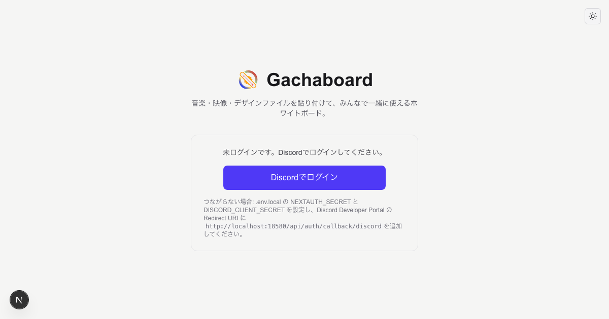
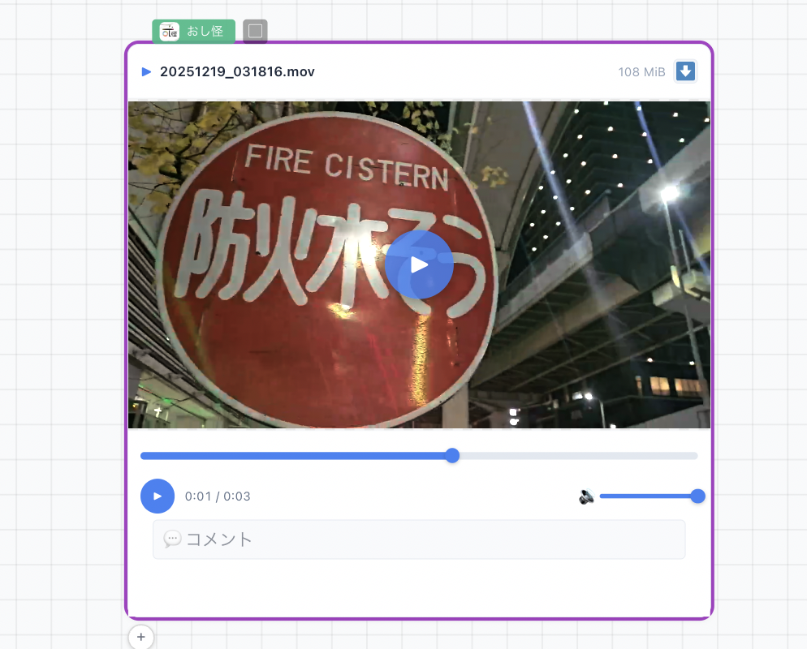
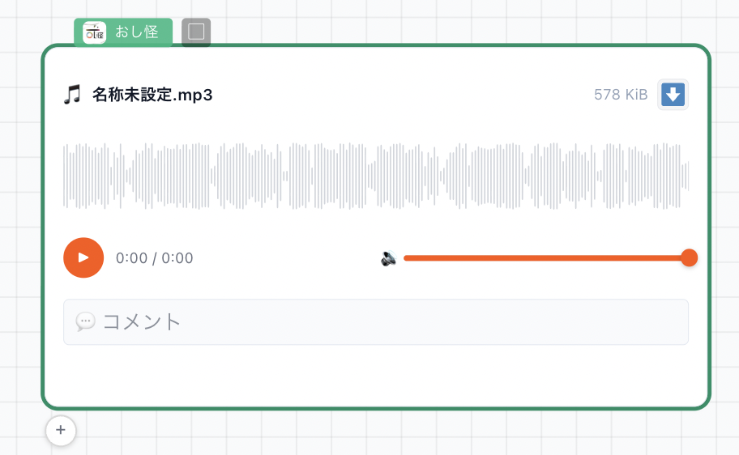
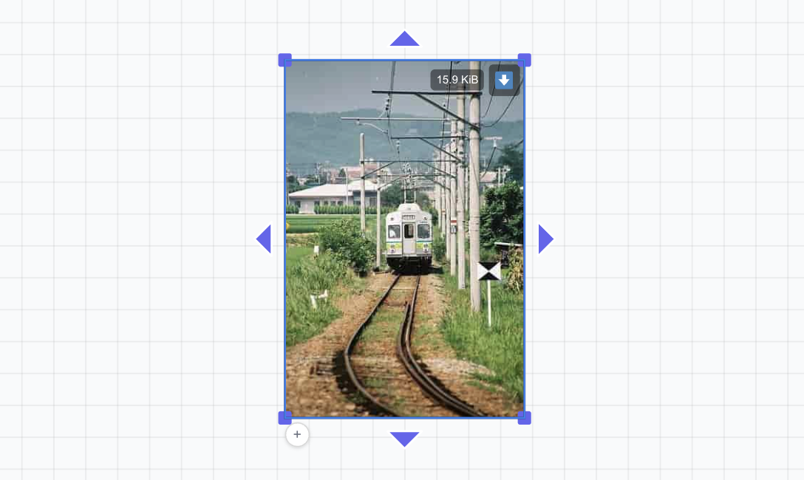
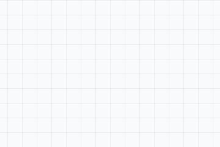
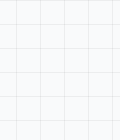
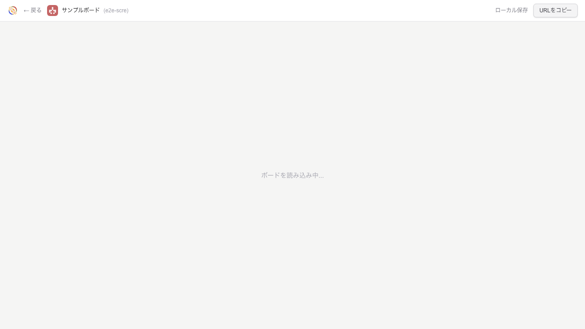
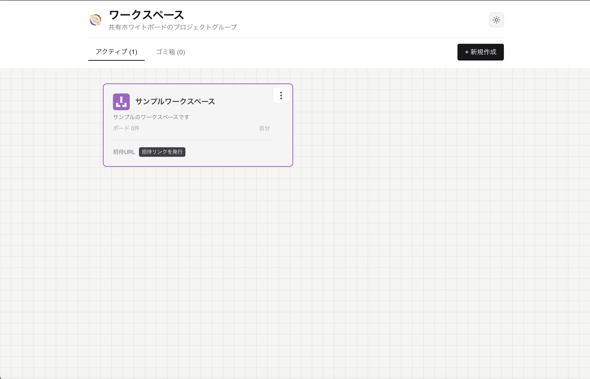

<div align="center">
  

<h1>
  
  Gachaboard
</h1>

<p>
    <strong>ホワイトボード + ファイルサーバのp2pシステム</strong><br>
    音楽・映像・デザインファイルを貼り付けて、リアルタイムで共同編集できる次世代ホワイトボード。
  </p>

<p>
    <a href="https://nextjs.org"></a>
    <a href="https://react.dev"></a>
    <a href="https://www.typescriptlang.org"></a>
    <a href="https://www.docker.com"></a>
    <br>
    <a href="LICENSE"></a>
  </p>
</div>

**フォーク元**: ホワイトボードエンジンは [DallasCarraher/compound](https://github.com/DallasCarraher/compound)（tldraw の Apache 2.0 フォーク）をベースにしています。

---

## 🚀 Gachaboard とは？

Gachaboard は、Discord コミュニティやクリエイティブチームのための**共同編集ホワイトボード**です。
動画・音声・テキスト・画像をドラッグ＆ドロップで自由に配置し、複数人で同時にレビューやブレストを行えます。

### 💡 Why Gachaboard?

- **🎨 クリエイターファースト**: 動画や音声を貼り、タイムラインに直接コメント。レビューが加速します。
- **🔒 安心のプライベート空間**: Discord 認証により、信頼できるメンバーだけのクローズドな環境を実現。
- **🏠 セルフホストで完結**: クラウド SaaS に依存せず、ローカルサーバー1台でデータも管理も手元に。
- **📱 どこでもアクセス**: Tailscale 対応で、グローバル IP なしでもスマホや外出先から接続可能。

---

## ✨ Features

### 📦 多彩なメディア対応

あらゆるクリエイティブ資産をボード上で扱えます。

#### 🎬 動画

720pに自動変換され、ブラウザ上でスムーズに再生。タイムラインにコメントを残せます。



#### 🎵 音声

波形が自動生成され、視覚的に分かりやすく。シーク再生も可能です。



#### 🖼️ 画像

ドラッグ＆ドロップで配置。リサイズやトリミングも自由自在。



#### 📄 テキスト・ファイル

コードのシンタックスハイライトや、各種ファイルのアイコン表示・ダウンロードに対応。

 

### ⚡️ Powerful Collaboration

- **リアルタイム同期**: Yjs による超高速な共同編集。誰がどこを触っているか一目でわかるマルチカーソル。
- **リアクション**: シェイプに絵文字でクイックに反応。
- **スマート接続**: draw.io 風の接続線で、要素間の関係性を可視化。
- **ワークスペース管理**: プロジェクトごとにボードをグループ化。招待リンクで簡単メンバー追加。

---

## 📸 Gallery

<div align="center">
  <h3>ボード編集画面</h3>
  

<h3>ワークスペース一覧</h3>
  
</div>

> [!TIP]
> スクリーンショットの再生成は、`cd nextjs-web && npm run screenshots:all` で実行できます。

---

## 🏁 クイックスタート

**Docker のみ**（Node.js 不要）または **Docker + Node.js** で起動できます。

### 方法 A: Docker のみで起動（Node.js 不要・Immich 式）

1. **リポジトリのクローン**
   ```bash
   git clone https://github.com/oshikaidesu/gachaboard.git
   cd gachaboard
   ```

2. **環境変数の作成**
   ```bash
   cp .env.example .env
   ```
   `.env` を開き、`DISCORD_CLIENT_ID` / `DISCORD_CLIENT_SECRET` / `NEXTAUTH_SECRET` を入力してください。  
   （web コンテナはルートの `.env` を参照します。必須項目の一覧は [docs/user/ENV-REFERENCE.md](docs/user/ENV-REFERENCE.md) を参照。）

3. **起動**
   ```bash
   docker compose --profile app up -d
   ```
   ブラウザで `http://localhost:18580` を開いてください。  
   （開発用の `npm run up` は Next を含まないため、Docker のみで動かす場合は上記コマンドを直接実行してください。）

4. **停止**
   ```bash
   docker compose --profile app down
   ```

---

### 方法 B: Docker + Node.js（開発・Tailscale 対応）

#### 1. セットアップ（初回のみ）

1. **リポジトリのクローン**（プロジェクトルートで作業）
   ```bash
   git clone https://github.com/oshikaidesu/gachaboard.git
   cd gachaboard
   ```
   リポジトリを親ディレクトリで管理している場合は、クローンしたディレクトリ（例: `gachaboard`）に `cd` してプロジェクトルートに移動してください。

2. **環境変数の作成と設定**
   ```bash
   npm run setup:env
   ```
   `nextjs-web/.env.local` を開き、次の項目を入力・確認してください。
   - `DISCORD_CLIENT_ID` / `DISCORD_CLIENT_SECRET`（[Discord Developer Portal](https://discord.com/developers/applications) で取得）
   - `NEXTAUTH_SECRET`（未設定の場合は setup 実行時に自動生成されます）
   - `SERVER_OWNER_DISCORD_ID`（任意）

3. **初回のみ: 依存パッケージとデータベース**
   ```bash
   cd nextjs-web && npm install --legacy-peer-deps && npx prisma generate && npx prisma db push && cd ..
   ```

#### 2. 起動

以上の手順でセットアップは完了です。起動方法は以下のとおりです。

| 方法 | 説明 |
|------|------|
| **Mac** | **`start.command` をダブルクリック**（Docker + Next.js をまとめて起動） |
| **Windows** | **`start.bat` をダブルクリック**（実行ポリシー不要・PS1 のラッパー） |
| ターミナル（Mac/Windows） | `npm run dev` |
| ローカルのみ | `npm run dev:local` |
| 本番 | `cd nextjs-web && npm run build && cd ..` の後 `npm start` |

ブラウザで表示された URL（例: `http://localhost:18580`）を開き、Discord でログインしてください。

> **Discord Redirect**: Discord Developer Portal の Redirects に `http://localhost:18580/api/auth/callback/discord` を追加してください。詳細は [docs/user/SETUP.md](docs/user/SETUP.md) を参照してください。

---

### 起動コマンド一覧

| コマンド | 説明 |
|----------|------|
| **start.command**（Mac） | Docker のみ or Tailscale モード（環境に応じて自動切り替え） |
| **start.bat**（Windows） | 同上（BAT ラッパー・ダブルクリックで起動） |
| `npm run up` | 依存サービスのみ起動（postgres / sync-server / minio。Next.js は含まない） |
| `npm run down` | 上記 Docker コンテナの停止 |
| `npm run dev` | 開発モード（Docker 依存サービス + ローカル Next.js） |
| `npm run dev:local` | 開発モード（localhost のみ） |
| `npm start` | ビルド済み起動（Tailscale） |
| `npm run start:local` | ビルド済み起動（localhost） |
| `npm run dev:tailscale:reset` | Docker リセット後に再起動 |
| `npm run reset:all` | **全データリセット**（PostgreSQL / MinIO / sync-server のデータを削除。新規で使い直すとき） |

**本番ビルド**（`npm start` を使用する場合）: 事前に `cd nextjs-web && npm run build` を実行してください。詳細は [docs/user/PRODUCTION-BUILD.md](docs/user/PRODUCTION-BUILD.md) を参照してください。

Tailscale モードでは `brew install tailscale jq` が必要です。HTTPS のセットアップは `npm run setup:tailscale-https` で行えます。手順は [TAILSCALE_HTTPS_SETUP.md](docs/user/TAILSCALE_HTTPS_SETUP.md) を参照してください。

**起動確認**: `cd nextjs-web && npm run status` で Docker / DB / MinIO / sync-server の状態を確認できます。

### プラットフォーム別メモ

| プラットフォーム | 事前準備 | 備考 |
|------------------|----------|------|
| **Mac** | Node.js 18+、[Docker Desktop](https://www.docker.com/products/docker-desktop/) または Colima | `brew install tailscale jq`（Tailscale 利用時） |
| **Windows** | [Node.js](https://nodejs.org/)、[Docker Desktop](https://www.docker.com/products/docker-desktop/)、[Git](https://git-scm.com/) | `copy` を `cp` の代わりに使用 |
| **Linux** | `apt install docker.io docker-compose-v2 git nodejs npm` 等 | - |

詳細は [docs/user/SETUP.md](docs/user/SETUP.md) を参照してください。

---

## 📚 Documentation

目的別に詳細なドキュメントを用意しています。

### 👤 [ユーザーガイド (docs/user/)](docs/user/README.md)

- [セットアップ手順 (SETUP.md)](docs/user/SETUP.md)
- [環境変数リファレンス](docs/user/ENV-REFERENCE.md)（ポート変更含む）
- [落ちたときに自動で再起動する](docs/user/AUTO-RESTART.md)（Docker / systemd / PM2）
- [24時間運用時の注意点](docs/user/24-7-OPERATION.md)（常時稼働・バックアップ・監視）
- [権限と招待の仕組み](docs/user/ownership-design.md)

### 💻 [開発者ガイド (docs/dev/)](docs/dev/README.md)

- [全体像と引き継ぎ (HANDOVER.md)](docs/dev/HANDOVER.md)
- [アーキテクチャ設計](docs/dev/ARCHITECTURE.md)
- [同期システムの仕様](docs/dev/yjs-system-specification.md)

---

## 🛠️ Tech Stack


| Category       | Technology                                     |
| :--------------- | :----------------------------------------------- |
| **Frontend**   | Next.js 16 (Turbopack), React 18, Tailwind CSS |
| **Whiteboard** | compound (tldraw engine)                       |
| **Realtime**   | Yjs, WebSocket                                 |
| **Auth**       | NextAuth.js (Discord OAuth)                    |
| **Database**   | PostgreSQL (Prisma)                            |
| **Storage**    | S3 / MinIO                                     |

> **Note:** ホワイトボードエンジンには [compound](https://github.com/tldraw/compound)（tldraw 系）の **alpha 版** を使用しています。API の安定性は開発状況に依存します。

---

## 🔒 セキュリティ・制限について

- **セルフホスト前提**: 本アプリは同一ネットワーク（または Tailscale 等で限定したアクセス）を信頼する設計です。sync-server（WebSocket）には接続時の認証はなく、**ネットワークに到達できる全員が共同編集に参加可能**です。インターネット公開時はリバースプロキシでアクセス制限することを推奨します。
- **本番環境**: Docker の PostgreSQL / MinIO のデフォルト認証情報は開発用です。本番では必ず変更してください（PostgreSQL は `DATABASE_URL`、MinIO は `AWS_ACCESS_KEY_ID` / `AWS_SECRET_ACCESS_KEY`。詳細は [環境変数リファレンス](docs/user/ENV-REFERENCE.md) および [SECURITY.md](SECURITY.md) を参照）。
- 詳細は [SECURITY.md](SECURITY.md) を参照してください。

---

## 開発について

本プロジェクトでは、設計・実装・ドキュメント整備に **AI エージェント（LLM ベースのコーディング支援）** を利用しています。AI の出力を編集のうえ取り込んでいる場合があり、内容の正確性は保証しません。個人の趣味で公開しているため、Issue や PR への対応はお約束できかねますが、指摘や議論は歓迎です。**コラボレーターとして参加して更新を手がけてくれる方がいれば、Issue で声をかけてもらえれば招待を検討します。**

---

## ⚖️ License

Apache 2.0 License
(Based on compound / tldraw)
