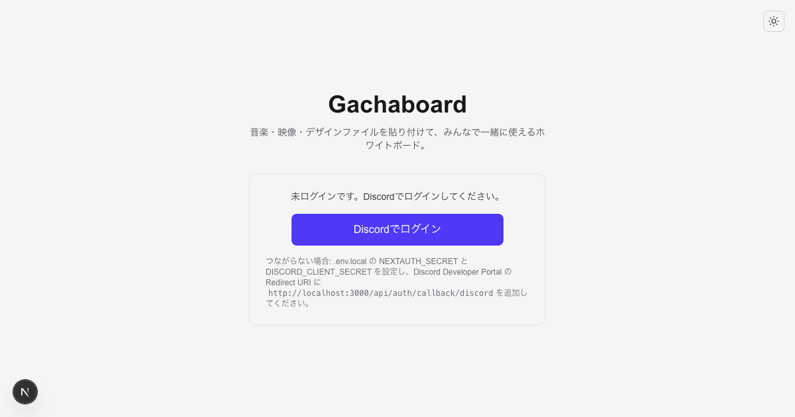
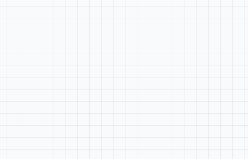
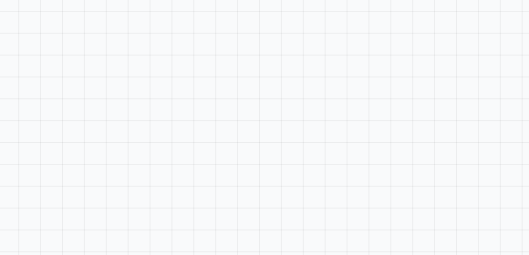
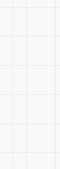
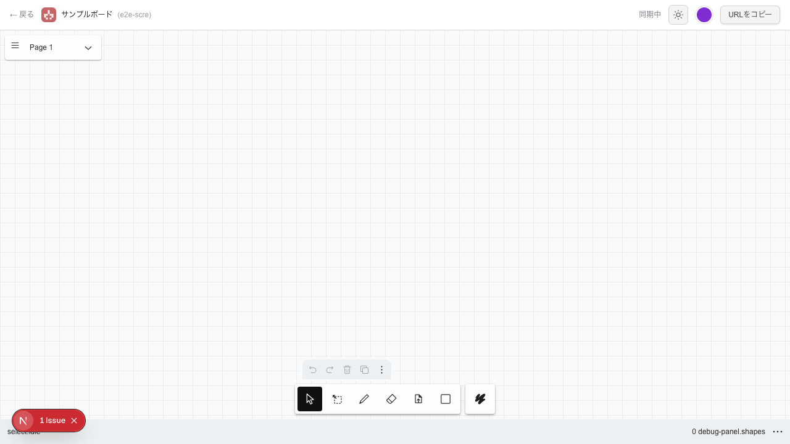
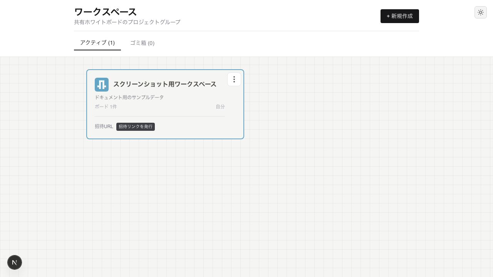

<div align="center">
  

  <h1>Gachaboard</h1>

  <p>
    <strong>「創る」を、もっと自由に。</strong><br>
    音楽・映像・デザインファイルを貼り付けて、リアルタイムで共同編集できる次世代ホワイトボード。
  </p>

  <p>
    <a href="https://nextjs.org"></a>
    <a href="https://react.dev"></a>
    <a href="https://www.typescriptlang.org"></a>
    <a href="https://www.docker.com"></a>
    <br>
    <a href="LICENSE"></a>
  </p>
</div>

---

## 🚀 Gachaboard とは？

Gachaboard は、Discord コミュニティやクリエイティブチームのための**共同編集ホワイトボード**です。
動画・音声・テキスト・画像をドラッグ＆ドロップで自由に配置し、複数人で同時にレビューやブレストを行えます。

### 💡 Why Gachaboard?

- **🎨 クリエイターファースト**: 動画や音声を貼り、タイムラインに直接コメント。レビューが加速します。
- **🔒 安心のプライベート空間**: Discord 認証により、信頼できるメンバーだけのクローズドな環境を実現。
- **🏠 セルフホストで完結**: クラウド SaaS に依存せず、ローカルサーバー1台でデータも管理も手元に。
- **📱 どこでもアクセス**: Tailscale 対応で、グローバル IP なしでもスマホや外出先から接続可能。

---

## ✨ Features

### 📦 多彩なメディア対応

あらゆるクリエイティブ資産をボード上で扱えます。

#### 🎬 動画
720pに自動変換され、ブラウザ上でスムーズに再生。タイムラインにコメントを残せます。



#### 🎵 音声
波形が自動生成され、視覚的に分かりやすく。シーク再生も可能です。



#### 🖼️ 画像
ドラッグ＆ドロップで配置。リサイズやトリミングも自由自在。



#### 📄 テキスト・ファイル
コードのシンタックスハイライトや、各種ファイルのアイコン表示・ダウンロードに対応。

 

### ⚡️ Powerful Collaboration
- **リアルタイム同期**: Yjs による超高速な共同編集。誰がどこを触っているか一目でわかるマルチカーソル。
- **リアクション**: シェイプに絵文字でクイックに反応。
- **スマート接続**: draw.io 風の接続線で、要素間の関係性を可視化。
- **ワークスペース管理**: プロジェクトごとにボードをグループ化。招待リンクで簡単メンバー追加。

---

## 📸 Gallery

<div align="center">
  <h3>ボード編集画面</h3>
  
  
  <h3>ワークスペース一覧</h3>
  
</div>

> [!TIP]
> スクリーンショットの再生成は `cd nextjs-web && npm run screenshots:all` で実行可能です。

---

## 🏁 Getting Started

Node.js 18+ と Docker があれば、数分で起動できます。

```bash
# 1. リポジトリのクローン
git clone https://github.com/oshikaidesu/gachaboard.git
cd gachaboard-compound

# 2. 環境設定
cp nextjs-web/env.local.template nextjs-web/.env.local
# .env.local を編集（Discord OAuth 情報などを入力）

# 3. 起動
docker compose up -d
cd nextjs-web
npm install --legacy-peer-deps
npx prisma generate
npx prisma db push
npm run dev
```

ブラウザで `http://localhost:3000` を開き、Discord でログインしてください。

---

## 📚 Documentation

目的別に詳細なドキュメントを用意しています。

### 👤 [ユーザーガイド (docs/user/)](docs/user/README.md)
- [セットアップ手順 (SETUP.md)](docs/user/SETUP.md)
- [環境変数リファレンス](docs/user/ENV-REFERENCE.md)
- [権限と招待の仕組み](docs/user/ownership-design.md)

### 💻 [開発者ガイド (docs/dev/)](docs/dev/README.md)
- [全体像と引き継ぎ (HANDOVER.md)](docs/dev/HANDOVER.md)
- [アーキテクチャ設計](docs/dev/ARCHITECTURE.md)
- [同期システムの仕様](docs/dev/yjs-system-specification.md)

---

## 🛠️ Tech Stack

| Category | Technology |
|:---|:---|
| **Frontend** | Next.js 16 (Turbopack), React 18, Tailwind CSS |
| **Whiteboard** | compound (tldraw engine) |
| **Realtime** | Yjs, WebSocket |
| **Auth** | NextAuth.js (Discord OAuth) |
| **Database** | PostgreSQL (Prisma) |
| **Storage** | S3 / MinIO |

---

## ⚖️ License

Apache 2.0 License
(Based on compound / tldraw)
