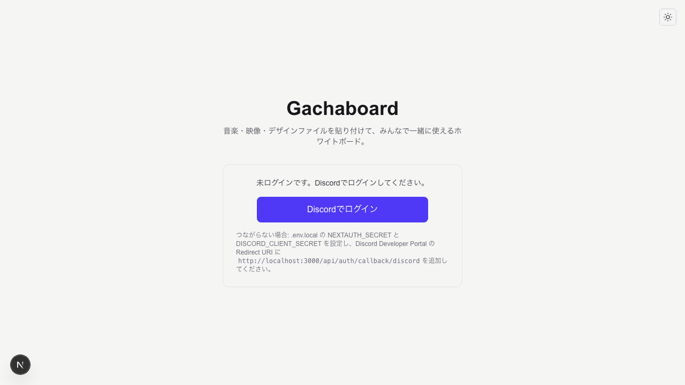
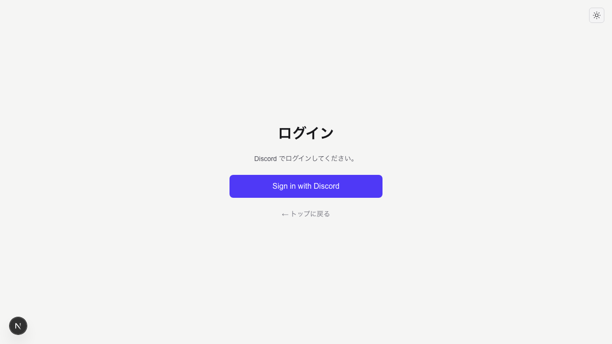
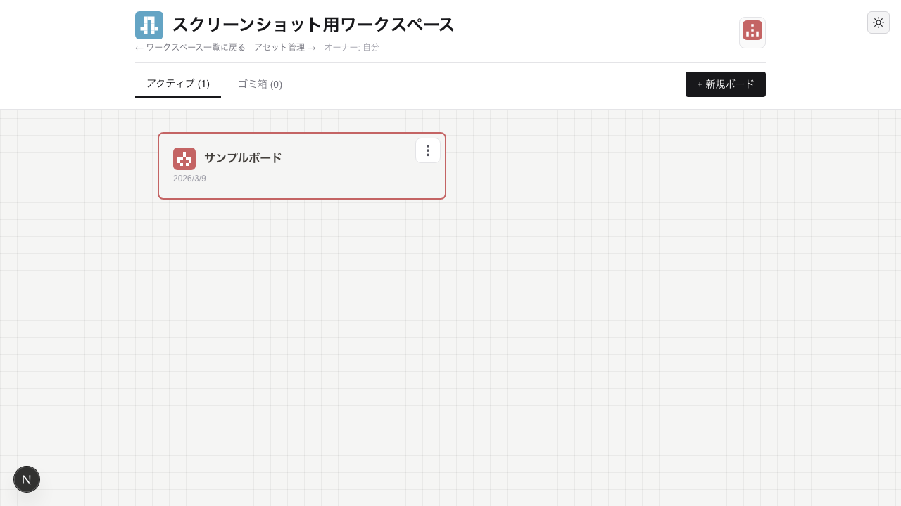

# Gachaboard

音楽・映像・デザインファイルを貼り付けて共有できる、リアルタイム共同ホワイトボードです。


---

## このプロジェクトについて

Gachaboard は、Discord コミュニティや身内チーム向けの共同編集ボードです。動画・音声・テキスト・画像をドラッグ＆ドロップでボードに並べ、複数人で同時に編集できます。URL を共有すれば、招待されたメンバーが同じボードで作業を進められます。

**想定している使い方**

- クリエイター同士のレビュー（動画・音声を貼ってコメントし合う）
- プロジェクト共有（デザイン案・コード・素材をボードに集約）
- ブレスト（画像・リンク・メモを並べて議論）

**設計の特徴**

- **ローカルサーバー 1 台で完結** … クラウド SaaS に依存しない
- **Discord 認証** … 匿名を排除し、身内だけの閉じた空間を実現
- **Tailscale 対応** … グローバル IP やポート開放なしで、スマホや他端末からアクセス可能

---

## 使い方の流れ

### 基本的な操作

1. **Discord でログイン** … 初回のみ
2. **ワークスペースを作成** … プロジェクト単位の入れ物。ここにボードを複数作る
3. **ボードを作成** … 実際に編集するホワイトボード。1 つのワークスペースに複数作れる
4. **ファイルをドラッグ＆ドロップ** … 動画・音声・テキスト・画像をボードに配置
5. **URL を共有** … ボードの URL を渡せば、同じワークスペースのメンバーが共同編集できる

### ワークスペースとボードの違い

| | ワークスペース | ボード |
|---|---------------|--------|
| **役割** | プロジェクトの入れ物。ボードをグループ化する | 実際に編集するホワイトボード |
| **数** | 1 人あたり複数持てる | 1 ワークスペースあたり複数持てる |
| **例** | 「〇〇プロジェクト」「チーム A」 | 「第 1 回レビュー用」「デザイン案 v1」 |

### オーナーと権限

| 種類 | 誰か | できること |
|------|------|------------|
| **サーバーオーナー** | 環境変数で指定した 1 人（未設定なら全員アクセス可） | ワークスペース一覧の表示・作成・削除 |
| **ワークスペースオーナー** | ワークスペースを作成した人 | 招待リンクの発行・リセット、メンバーのキック |
| **招待メンバー** | 招待リンクで参加した人 | ボード・アセットの編集。参加 24 時間後は他メンバーのキックも可能 |

招待リンクはワークスペース一覧の 3 点メニュー → 「招待リンク」から発行。リンクを知っている人が参加できる。詳細は [ownership-design.md](docs/user/ownership-design.md) を参照。

### 画面のイメージ

| トップ（未ログイン） | サインイン | ボード編集 |
|---------------------|------------|------------|
|  |  |  |

| ワークスペース一覧 | ワークスペース詳細（ボード一覧） |
|-------------------|--------------------------------|
|  |  |

※ スクリーンショットの再生成: `cd nextjs-web && npm run screenshots:all` で一括実行（シード → サーバ起動 → 撮影）。手動で行う場合は `npm run seed:e2e` → 別ターミナルで `npm run e2e:server` → `npm run screenshots`。

---

## できること

- **ファイル共有** … 動画・音声・テキスト・画像をボードに配置。動画は 720p に変換、音声は波形表示
- **リアルタイム共同編集** … 複数人が同時に編集。マルチカーソルで誰がどこにいるか表示
- **コメント・リアクション** … 動画・音声のタイムラインにコメント、シェイプに絵文字リアクション
- **接続ハンドル** … draw.io 風の接続点でシェイプ同士を矢印でつなげる
- **ワークスペース** … プロジェクト単位でボードをグループ管理。招待リンクでメンバーを追加

---

## はじめ方

Node.js 18+ と Docker、Discord アプリが必要です。

```bash
git clone https://github.com/oshikaidesu/gachaboard.git
cd gachaboard-compound

cp nextjs-web/env.local.template nextjs-web/.env.local
# .env.local を編集（Discord OAuth の Client ID / Secret、DATABASE_URL 等）

docker compose up -d
cd nextjs-web && npm install --legacy-peer-deps && npx prisma generate && npx prisma db push && npm run dev
```

ブラウザで http://localhost:3000 を開き、Discord でログインしてください。

**詳細なセットアップ手順**は [docs/user/SETUP.md](docs/user/SETUP.md) を参照。

---

## 技術スタック

Next.js 16 + React 18、compound（tldraw 系ホワイトボード）、Yjs によるリアルタイム同期、NextAuth + Discord OAuth、PostgreSQL、S3/MinIO。

---

## ドキュメント

セットアップ・運用は [docs/user/](docs/user/README.md)、設計・技術仕様は [docs/dev/](docs/dev/README.md) を参照。

---

## ライセンス

Apache 2.0（compound / tldraw ベース）
